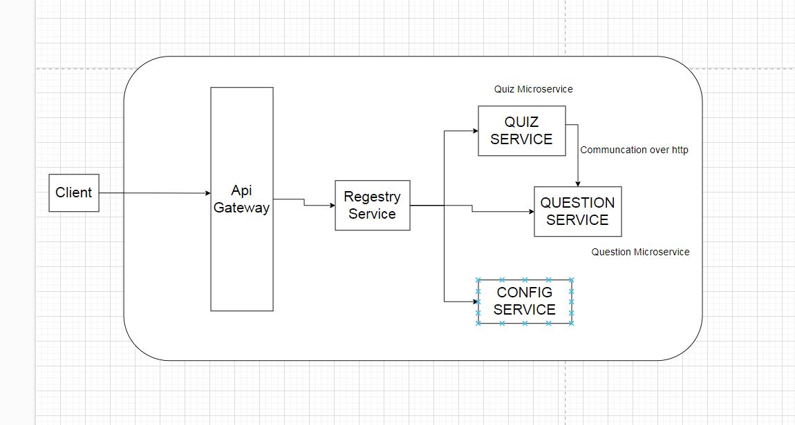

Project Name: Microservice Architecture Example

Description:

This repository implements a microservice architecture using Spring Boot and Spring Cloud Netflix, consisting of four services:

QUIZ-SERVICE (port:8081): Manages quizzes and their associated data.
QUESTION-SERVICE (port:9092): Provides CRUD operations for individual questions.
REGISTRY-SERVICE (port:8761): Acts as a Eureka Server for service discovery.
API-GATEWAY (port:8084): Serves as a single entry point for API requests, routing them to the appropriate microservice.
Key Features:

Clean separation of concerns: Each service has a well-defined responsibility, promoting maintainability and scalability.
Improved flexibility: Independent deployment and scaling of services based on individual needs.
Fault isolation: Issues in one service don't cascade to others, enhancing overall resilience.
Spring Cloud Netflix integration: Leverages Eureka for service discovery and Hystrix for fault tolerance and circuit breaking.
Open Feign: Streamlines inter-service communication with declarative API interactions.
Getting Started:

Prerequisites:
Java 11+
Maven or Gradle
Docker and Docker Compose (recommended)
Clone the repository:
Bash
git clone https://github.com/YOUR-USERNAME/microservice-architecture-example.git
Use code with caution.
Build and run:
Bash
cd microservice-architecture-example
docker-compose up -d
Use code with caution.
Access the API Gateway:
http://localhost:8084/swagger-ui.html for API documentation.
Structure:

microservice-architecture-example/
├── quiz-service/
│   ├── src/main/java/com/example/quizservice/... (Java source code)
│   ├── pom.xml (Maven configuration)
├── question-service/
│   ├── src/main/java/com/example/questionservice/... (Java source code)
│   ├── pom.xml (Maven configuration)
├── registry-service/
│   ├── src/main/java/com/example/registryservice/... (Java source code)
│   ├── pom.xml (Maven configuration)
├── api-gateway/
│   ├── src/main/java/com/example/apigateway/... (Java source code)
│   ├── pom.xml (Maven configuration)
├── docker-compose.yml (Docker Compose configuration)
├── readme.md (This file)
└── licenses/ (Third-party license files)
Dependencies:

Each service includes the necessary Spring Boot and Spring Cloud Netflix dependencies specified in its pom.xml file.

Inter-service Communication:

QUESTION-SERVICE is deployed independently and accessed by QUIZ-SERVICE using Open Feign Client.
Services discover each other through the Eureka Registry-Service.
Notes:

This is a basic example and can be extended to include additional features and services.
For production environments, consider container orchestration and configuration management tools.
Implement security measures like authentication and authorization to protect API endpoints.

